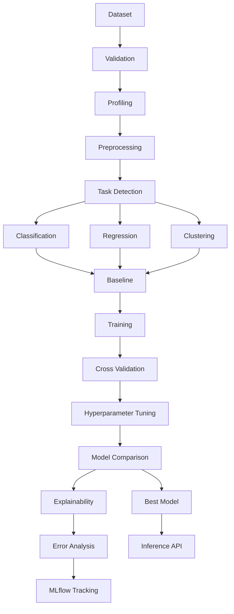

# AutoML Production Pipeline

A modular, production-style machine learning pipeline for structured tabular data. It validates datasets, profiles them, detects the task type, trains multiple model families, tracks experiments with MLflow, compares results, explains model behavior, and exposes a reusable inference API.

## Why This Project?

Organizations often have raw tabular data but lack a reliable, repeatable process to move from exploratory analysis to production ML. This project addresses that gap by combining validation, preprocessing, task detection, model benchmarking, explainability, and deployment-ready APIs into a single reusable architecture. It is designed to be a serious AI/ML internship or portfolio project that demonstrates clean engineering and MLOps habits.

## Features

- Dataset loading for CSV, Parquet, and Excel files
- Automatic validation and profiling for missing values, duplicates, cardinality, and leakage risks
- Reusable preprocessing pipelines for numeric, categorical, and datetime features
- Task detection for classification, regression, and clustering
- Model registry with baseline, traditional, and ensemble models
- Cross-validation and Optuna-based hyperparameter optimization
- Automated model comparison and ranking
- Explainability with permutation importance and SHAP support
- MLflow-backed experiment tracking and artifact persistence
- FastAPI-ready inference and evaluation endpoints
- CLI for profiling, training, tuning, prediction, and evaluation
- Unit and integration tests with pytest

## Architecture



## Project Structure

```text
.
├── README.md
├── LICENSE
├── CONTRIBUTING.md
├── CODE_OF_CONDUCT.md
├── .gitignore
├── .env.example
├── pyproject.toml
├── requirements.txt
├── Dockerfile
├── docker-compose.yml
├── configs/
│   ├── config.yaml
│   ├── classification.yaml
│   ├── regression.yaml
│   └── clustering.yaml
├── data/
│   ├── raw/
│   ├── processed/
│   └── external/
├── notebooks/
│   ├── 01_data_exploration.ipynb
│   ├── 02_classification.ipynb
│   ├── 03_regression.ipynb
│   └── 04_clustering.ipynb
├── src/
│   └── ml_pipeline/
│       ├── __init__.py
│       ├── __main__.py
│       ├── config.py
│       ├── data/
│       ├── preprocessing/
│       ├── tasks/
│       ├── models/
│       ├── training/
│       ├── evaluation/
│       ├── explainability/
│       ├── inference/
│       ├── tracking/
│       ├── utils/
│       └── api/
├── models/
├── reports/
│   ├── figures/
│   ├── metrics/
│   └── experiments/
├── tests/
│   ├── unit/
│   ├── integration/
│   └── conftest.py
└── .github/
    └── workflows/
        └── ci.yml
```

## Quick Start

```bash
python -m venv .venv
source .venv/bin/activate
pip install -r requirements.txt
python -m ml_pipeline profile data/raw/sample.csv
python -m ml_pipeline train --data data/raw/sample.csv --target target --task classification
```

## Configuration

The project uses YAML configuration files in the `configs/` directory. The default configuration is easy to modify without touching the code.

## Testing

```bash
pytest -q
```

## License

This project is licensed under the MIT License.

## Contributing

Please see [CONTRIBUTING.md](CONTRIBUTING.md) for contribution guidance.
